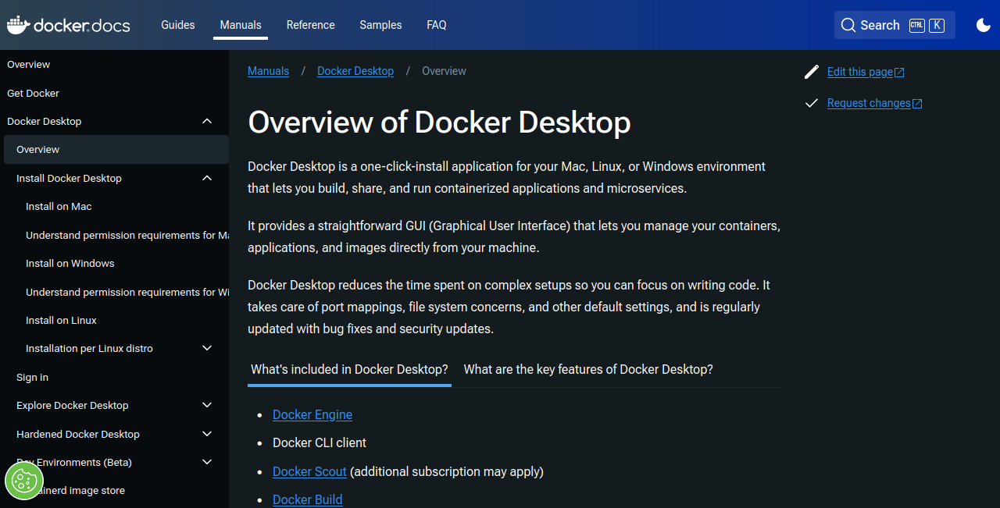
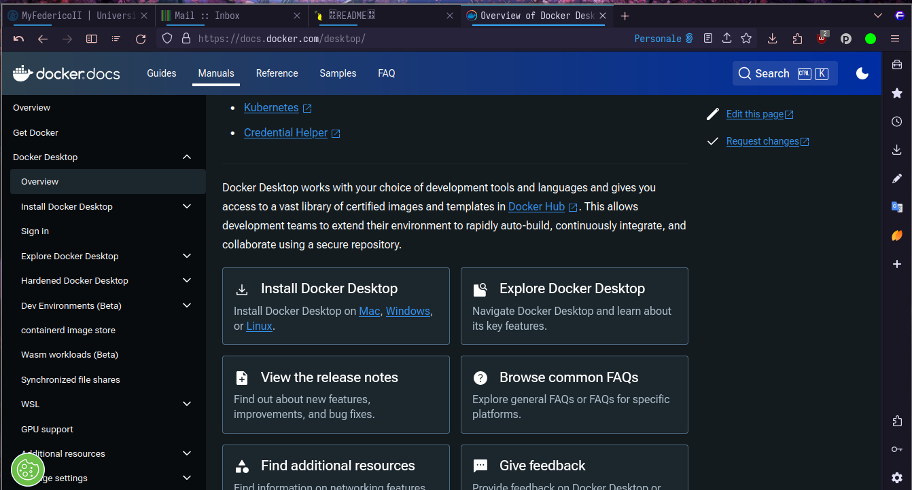
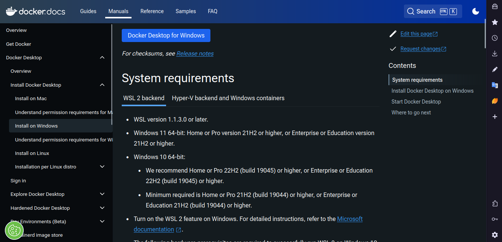
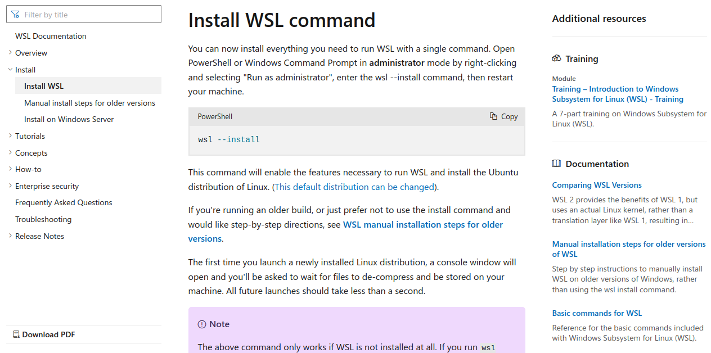
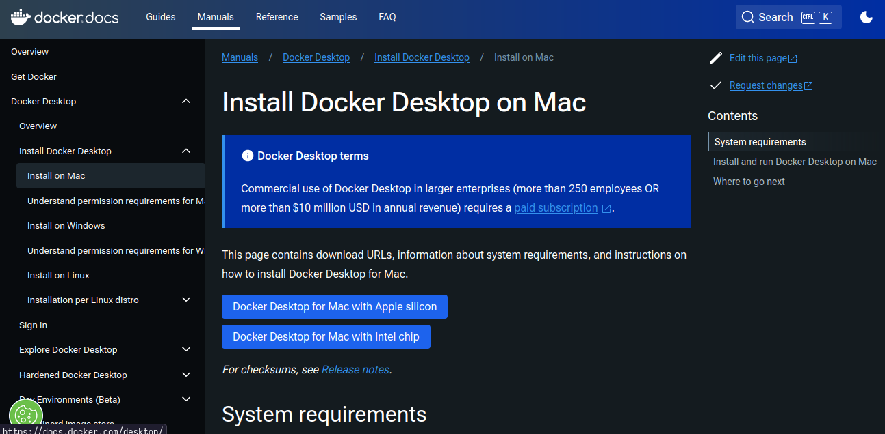
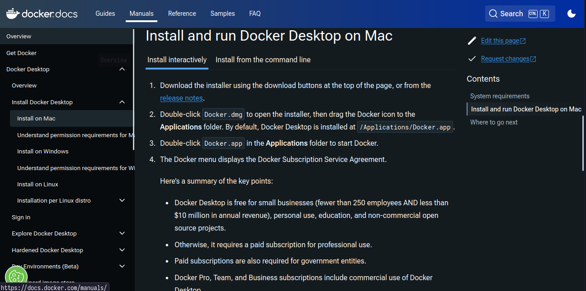
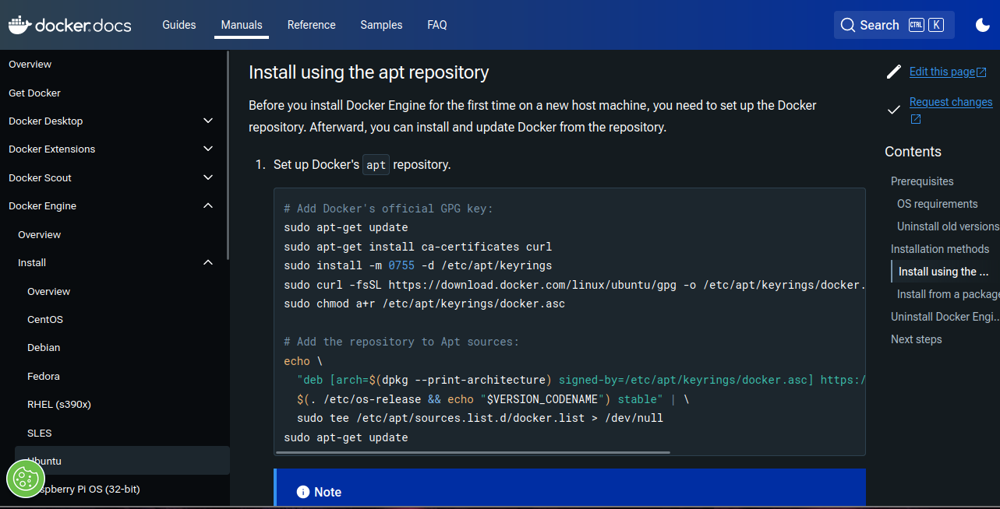

# Docker Hello world

## Installing Docker
Visit the web [page](https://docs.docker.com/desktop/) and click on the correct link based on your OS. 
Next, to the section matching your environment.





### POV: you are on Windows
To run Docker on Windows, you need some extra step.

You need to install WSL2 (Windows subsystem for linux).
Other requirements listed in the page should be automatically satisfied if you have 
successfully installed a Linux virtual machine.



#### Installing WSL
To install WSL, visit the [docs](https://learn.microsoft.com/en-us/windows/wsl/install?source=docs).

Open a `Powershell (Administrator prompt)` and run the command `wsl --install`.


Now you should have an Ubuntu CLI integrated in Windows!

#### Installing Windows Terminal
Windows terminal is an utility used to create and manage terminal like in Linux.
You can install it from the [official documentation](https://learn.microsoft.com/en-us/windows/terminal/install).


### POV: you are on MAC (intel/arm chip)
You should be fine: Docker is supported on recent version of macOS.



Just follow the instruction and you should have a working Docker installation.



### POV: you are on Linux
Docker is natively supported by Linux. Before installing Docker desktop
we need to install the Docker engine.  For example, if you are on a Debian based distro,
you can find the [docs](https://docs.docker.com/engine/install/ubuntu/#install-using-the-repository)



This script sets up your repository, now you can install by running the command:
```sh 
sudo apt-get install docker-ce docker-ce-cli containerd.io docker-buildx-plugin docker-compose-plugin
```

Now, if you want you can install Docker Desktop but it is not necessary for this lab.

#### Permission issues
If you are on Linux, you can run containers with `sudo`. If you want to execute `docker` 
as a normal user you can put yourself in the `docker group` running the command:
```sh 
sudo usermod -aG docker <your username>
```
Restart your machine and now you are ready to test the installation.

## Testing your docker installation
Every one should have Docker installation. To check if everything worked open 
a terminal (Windows terminal for Windows users) and run the command:
```sh
docker run hello-world
```

You should get an output like this:
```sh
Unable to find image 'hello-world:latest' locally
latest: Pulling from library/hello-world
c1ec31eb5944: Pull complete
Digest: sha256:91bc16c380fe750bcab6a4fd29c55940a7967379663693ec9f4749d3878cd939
Status: Downloaded newer image for hello-world:latest

Hello from Docker!
This message shows that your installation appears to be working correctly.

To generate this message, Docker took the following steps:
 1. The Docker client contacted the Docker daemon.
 2. The Docker daemon pulled the "hello-world" image from the Docker Hub.
    (amd64)
 3. The Docker daemon created a new container from that image which runs the
    executable that produces the output you are currently reading.
 4. The Docker daemon streamed that output to the Docker client, which sent it
    to your terminal.

To try something more ambitious, you can run an Ubuntu container with:
 $ docker run -it ubuntu bash

Share images, automate workflows, and more with a free Docker ID:
 https://hub.docker.com/

For more examples and ideas, visit:
 https://docs.docker.com/get-started/
```
## Playing with Docker
Now, you can execute any possible operating system with one command!
For example, you can create an Ubuntu instance.
```sh 
docker run ubuntu
```
*Why* does it exits immediately?

We need to tell the docker engine that we want to **interact** with the container.

```sh 
docker run -it ubuntu
```

Now you have a shell in an ubuntu container!

## Your first Docker application
To test things out, we can deploy a simple python application.

The application will print out information about the operating system 
and will ask for a username. The code should look like this.

```py
import platform
import sys

print("Hello, you are executing me from", platform.machine(), "processor")
print("Platform information:", platform.platform())
print("OS:", platform.system())
print("Python:", sys.version)
name = input("Give me your name: \n")

print("Hello,", name)

```

Now we need a Dockerfile. For example we decide to use this one:

```dockerfile
FROM python:3.10.14-bookworm

WORKDIR /app
COPY main.py .

CMD [ "python", "/app/main.py" ]
```

Now we can build the image with the command:

```sh
docker build -t dtlab-docker .
```

And we execute it

```sh 
docker run -i dtlab-docker
```

**STOP and THINK**: what does the `-i` flag do?

