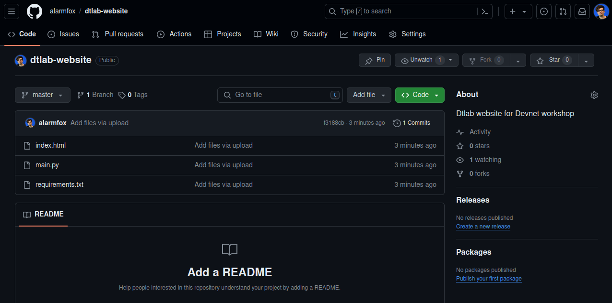

# A Python web-server with Docker

## Goal
We want to deploy a web server application using Docker.

### Integrated web-server
Did you know? Python already has an integrated web server.
We can run a web server by running the command:

```py
python -m http.server 3000
```

Let's put it in a Docker container. So we need a Dockerfile

```dockerfile
FROM python:3.10.14-bookworm

WORKDIR /

CMD [ "python", "-m", "http.server", "3000" ]

```

Build the image
```sh 
docker build -t dtlab-simple-webserver .
```

Run the container
```sh 
docker run -p 3000:3000 dtlab-simple-webserver:latest
```

**STOP and THINK**: what does `-p` flag do?

## Now it's your turn

### Scenario
You are working as a DevOps engineer and you need to deploy an website. The developer
used Python and sends you a Github link. Code can be found at this [link](https://github.com/alarmfox/dtlab-website). 

Click on the `code` button and dowload the directory as a ZIP.


You need to:
* Download the source code from Github;
* Create a Dockerfile;
* Running the application as a Docker container on your PC;

#### Downloading code from Github
You can simply donwload someone's code from Github, by downloading a ZIP.
The code has 3 files: 
1. `main.py`: a python script acting as a webserver;
2. `index.html`: the entrypoint for every website;
3. `requirements.txt`: a list of libraries the developer used;

#### Creating the Dockerfile
The Dockerfile is similar to the previous one, but we need to **COPY** also 
the files `index.html` and `requirements.txt`. Also we need to and a **RUN** 
command to install the libraries from the `requirements.txt` file.

#### Running the application
Like the previous example you can the application by using the `docker run` command.

**DOES IT WORK?** If not, why? Try to inspect the python script and see if you see an error!
You can fix it and re-build the image!
