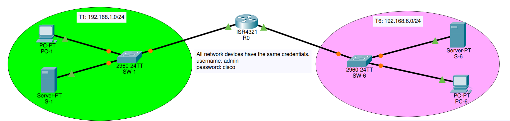
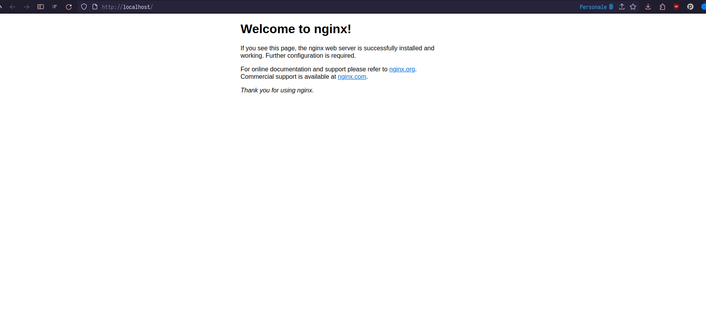
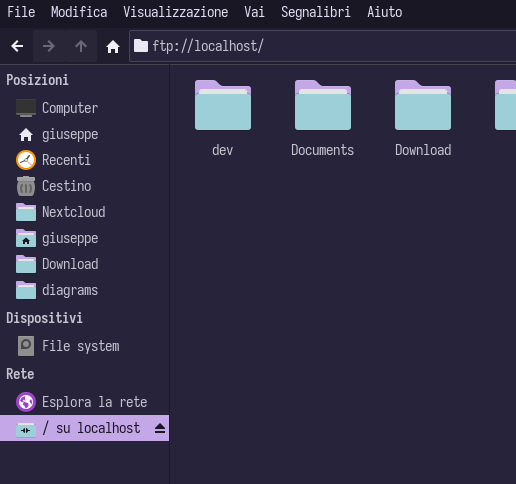

# Lab 3 - Configure a ZPF

We will work in pair tables. Each table will have a LAN and will have to forward only
the correct traffic class to the other one.



Even tables (2, 4, 6) will have to forward **FTP** traffic while odd tables (1, 3, 5) 
will have to allow **HTTP** traffic. 

### Running test services
You can use Docker to run test servers. For example, to run a web server you can use:

```sh 
docker run -p 80:80 nginx
```

Open your browser on localhost. You should see the following:



While for an ftp server, the command will be (substitute the <path-to-dir> with a real directory you want to share):

```sh 
docker run --env FTP_PASS=123 --env FTP_USER=user  --publish 20-21:20-21/tcp --publish 40000-40009:40000-40009/tcp --volume <path-to-dir>:/home/user garethflowers/ftp-server
```

You can check the configuration by running an ftp client. Open your file explorer and put the following in your bar




## Configuration steps
***Assumptions***: the topology does not need routing as the networks are directly attached. 
In the initial state, all devices can be reached through `ping` and hosts in T1 network
can configure switch in T6 network. Assume that the server has a static IP address 
configured.

Some part of the Lab will require the two tables to interact and agree on policies

### Zone configuration
The two tables will interact to decide zone names. These names will be used to create
the `zone-pair` and to assign the interface with the `zone-member securitu <zone-name>`
command.

Configure the zones in the router with the `zone security <zone-name>`.

### Traffic type identification

Now each group will create a **class map** to identify the traffic to forward.

***Remember***: a default class action exists and drops every packet by default.

The traffic type should have two elements:
1. identify source and destination IP addresses: for this purpose you should create 
an **extended** ACL allowing for IP protocol specifying as source the LAN source and as 
destination the static server IP address;
2. allow HTTP (or FTP traffic): use multiple **match** statements when configuring the 
class map;

For example:
```
r0(config)#access-list 100 permit ip 192.168.1.0 0.0.0.255 host 192.168.6.50
r0(config)#class-map type inspect match-all t1-traffic
r0(config-cmap)#match access-group 100
r0(config-cmap)#match protocol http
r0(config-cmap)#exit
r0(config)#
```

### Create a policy
Now you should create a policy and attach the created class map to it. 
```
R0(config)#policy-map type inspect t1-policy
R0(config-pmap)#class type inspect t1-traffic
R0(config-pmap-c)#inspect
R0(config-pmap-c)#
```

### Create a zone-pair
Now you can create a pair and assign the policy to it. For example, we will 
configure the policy from t1 to t6.

```
R0(config)#zone-pair security t1-2-t6 source <t1-zone> destination <t6-zone>
R0(config-sec-zone-pair)#service-policy type inspect t1-policy
R0(config-sec-zone-pair)#exit
```

### Assign the zones to the interfaces
Finally you can assign the interfaces according to zones. For example, if `<t1-zone>`
is attached to interface `g/0/0/0`, command should be:

```
R0(config)#interface g/0/0/0
R0(config)#zone-memeber security <t1-zone>
```

### Verify
Now you should be able to visit the web server on **192.168.6.50**, but you cannot 
access any devices with ICMP messages. Same should be for FTP server for
**192.168.1.50**.

