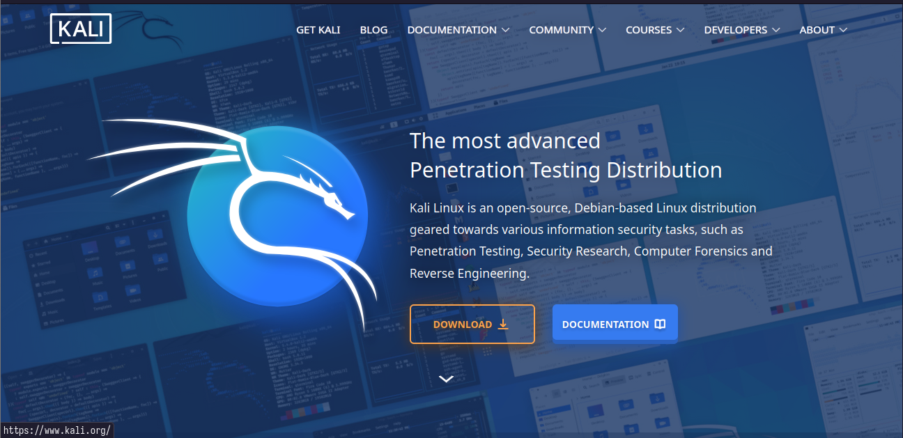
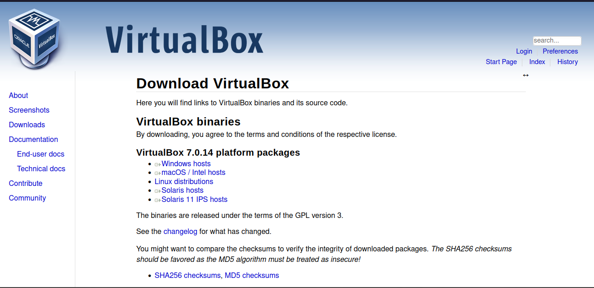

# Setup a linux virtual machine
We will be using [Kali Linux](https://www.kali.org/) for the cybersecurity class. 
Any other linux environment will be fine (feel free to reach out if you encounter 
any issues with software we use during practical labs).

If you have already a linux machine skip the installation phase.

## Download ISO
Get your Kali Linux ISO [here](https://www.kali.org/get-kali/#kali-installer-images).

### Hypervisor setup
Now you need an hypervisor (something that runs virtual machines). We will use 
Virtual Box which can be download from the [official site](https://www.virtualbox.org/wiki/Downloads)
(most likely you will have to download the Windows Hosts version.)

