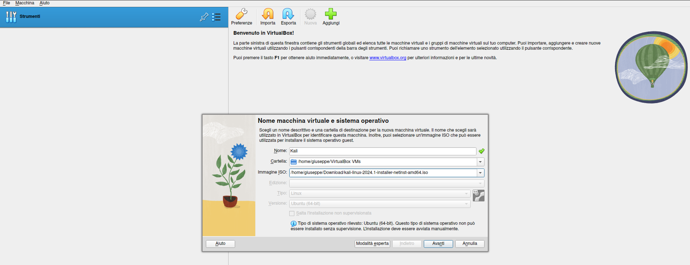
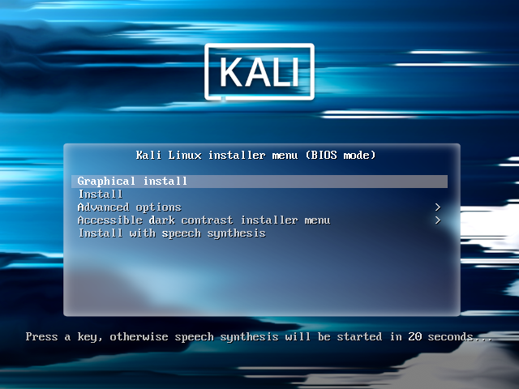
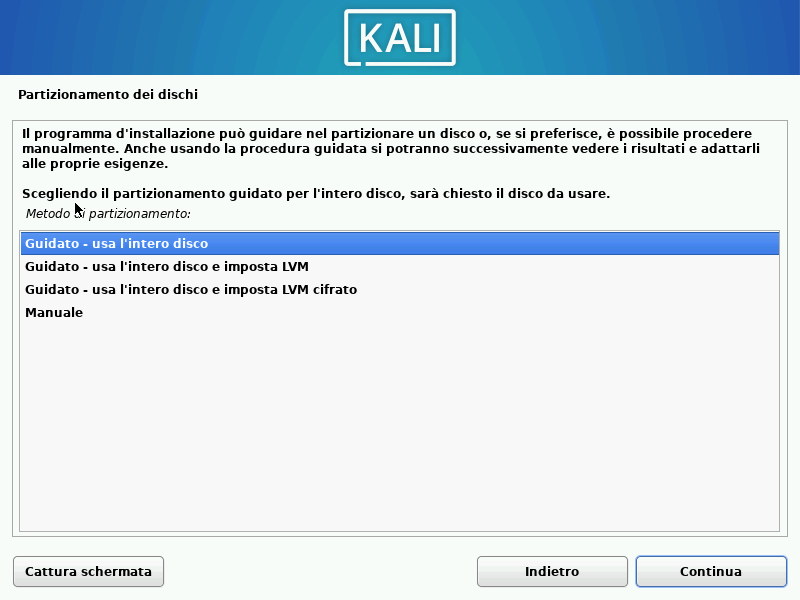
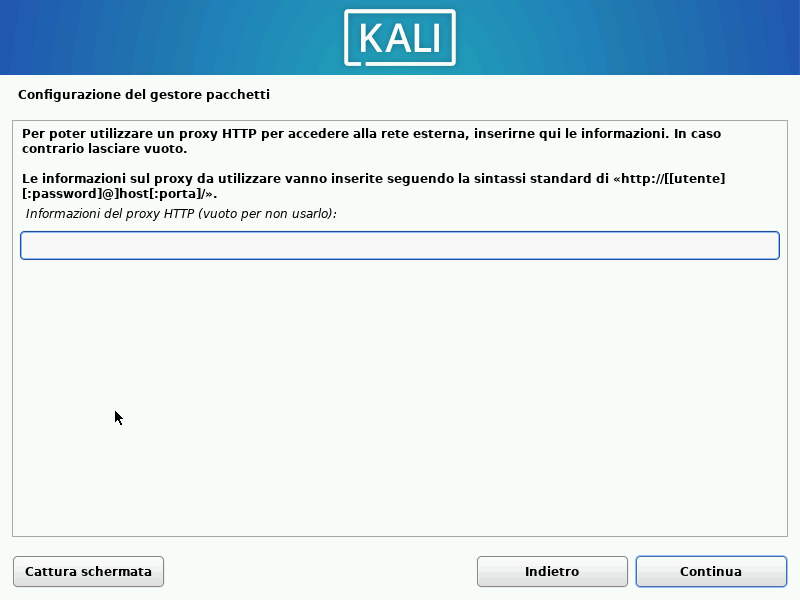
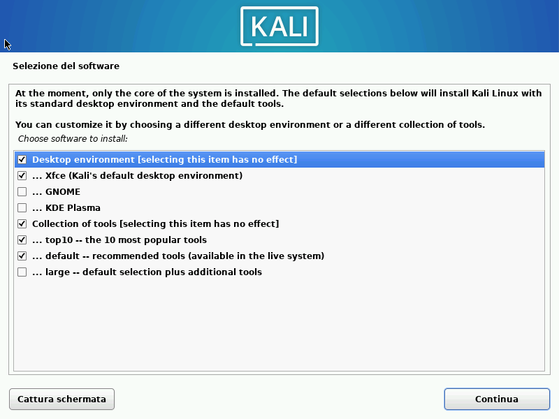

# Setup a linux virtual machine
We will be using [Kali Linux](https://www.kali.org/) for the cybersecurity class. 
Any other linux environment will be fine (feel free to reach out if you encounter 
any issues with software we use during practical labs).

If you have already a linux machine skip the installation phase.

## Download ISO
Get your Kali Linux ISO [here](https://www.kali.org/get-kali/#kali-installer-images).

### Hypervisor setup
Now you need an hypervisor (something that runs virtual machines). We will use 
Virtual Box which can be download from the [official site](https://www.virtualbox.org/wiki/Downloads)
(most likely you will have to download the Windows Hosts version.)

Create a new virtual machine, as in pictures.
    

Give it a name and select the ISO you just downloaded.

Finally, give it at least 2GB ram and 2CPUs and start the installation!

### Installation guide
Installation is very simple. Just follow the instructions!

First, you will see a screen like this:

Choose graphical install and go on, you will be asked for general informations about languages 
and to create a user (provide username and password).

Create a simple partition scheme and confirm choices (select `yes`):

Leave blank here and click `Continue`:

Select default option for installation:

When the installation end, you should reboot in your new virtual machine.
