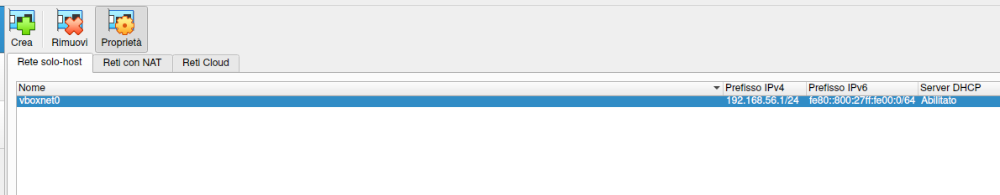
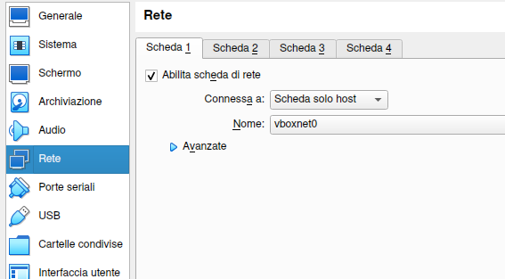
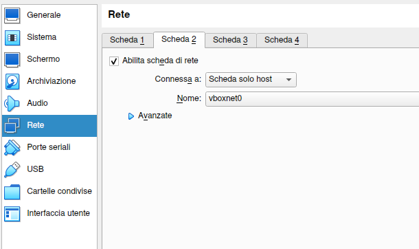
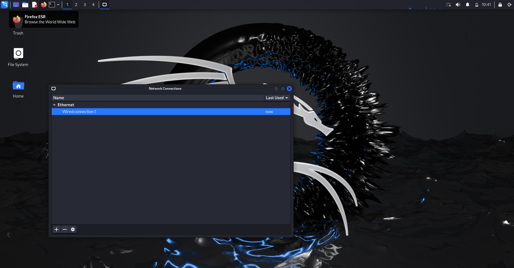
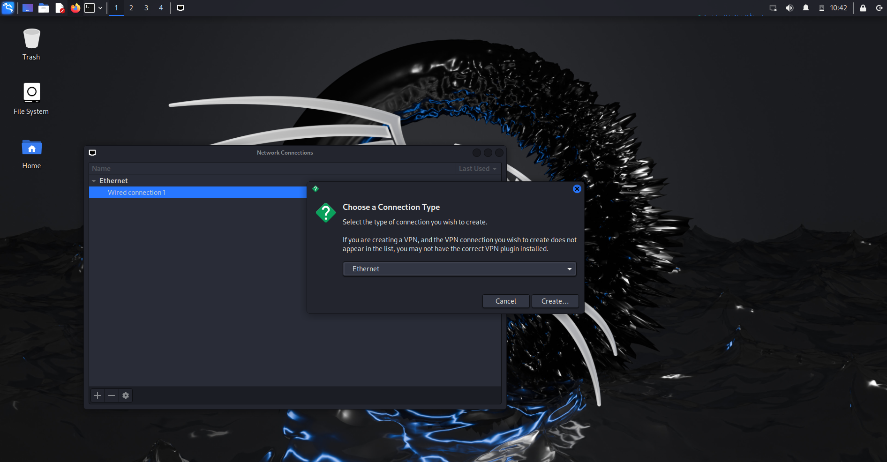
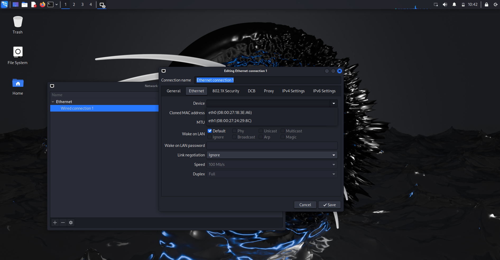
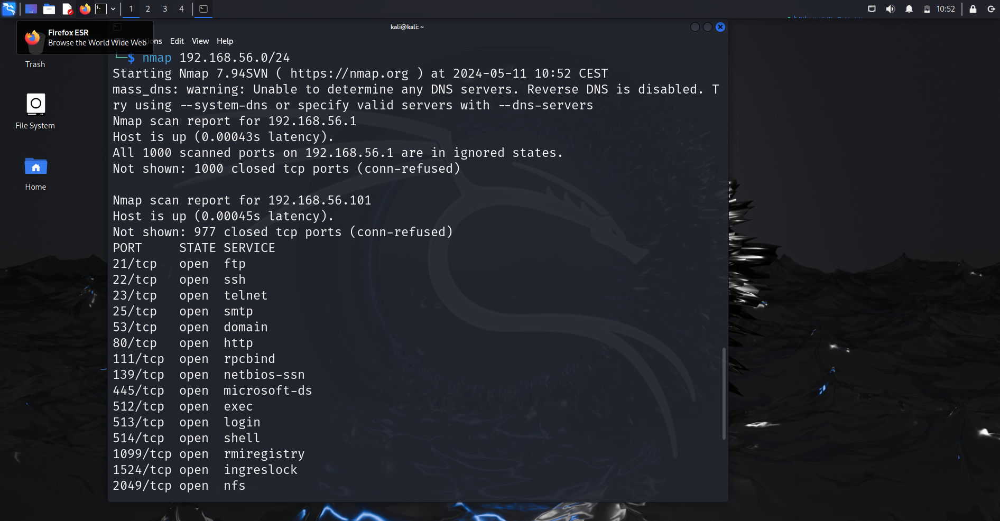

# Multi VM setup

## Description
In this activity, you will learn how to make two different virtual machines communicate. 

You will create a dedicated virtual network on your hypervisor and attach both virtual machines to it. 

## Virtual Box
If you have Virtual Box as your hypervisor, you will need to go into `Files -> Tools -> Network tools`
and create a new host network by clicking on the `New` button.

Once you click on `New`, a new network will be created with a dedicated IP LAN and a DHCP.
Now you can use this network to make all your virtual machines to communicate.

## Attaching Host to the created VM

#### Metasploitable
For Metasploitable2 is simple: just go into settings and choose from the current NIC (it's 
not needed to enable a new one).

Reboot the virtual machine and now it should have an IP from the virtual network you created.

### Kali Linux
For example, if you want to attach Kali Linux to the new Network, go into VM settings, 
enable an extra adapter and choose the `vboxnet0`.

When you enable an extra NIC, you will likely have to configure it (by default Kali configures 
only the first NIC). Start the virtual machine and enable the connection like in the pictures 
below.

First, go to `Advanced Network Settings` and create a new Profile.

Choose Ethernet when asked.

Select `eth1` for the device.

Make sure, DHCP is enabled.

## Result
Now you have two virtual machines in the same virtual network and you can make practice on 
your own!

Here it is the result of nmap from Kali Linux in the virtual network created.

