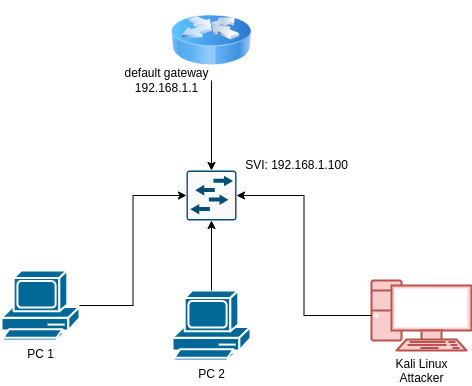
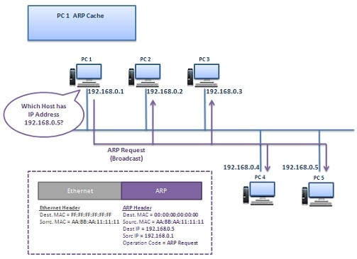
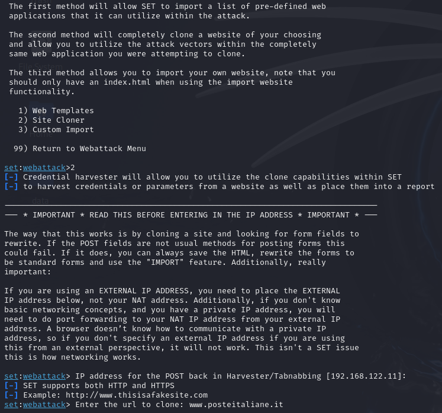

# LAB - Arp/Dns Spoofing 
## Introduction
During this lab, you will practice layer 2 and layer 3 networking concept and understand spoofing attacks.
The goal of this is lab to explore Linux tools to perform a Man in The Middle (MiTM) attack and learn 
possible countermesures.

## Requirements
For this lab, we will use the simple topology you implemented last time during the CCNA lab. Since ARP is a 
layer 2 protocol, it's limited by broadcast domains: you cannot perform this attack from a different LAN.  
Every table is a LAN (as shown in the picture); you can choose your favourite addressing plan
(ie. 192.168.1.0/24). At the end of the setup, you will have a situation like in the picture.




You will need at least a Kali Linux per LAN: it will be used to perform the attack.

### Attacker NIC in bridge mode
If you are using Kali in a virtual machine you will need to obtain an ip address on the same LAN as 
the victim and configure it. You will need to perform some modification in the Virtual Box configuration,
like in the picture below. Change the Network interface type, from NAT to bridge and from within Kali 
assign a valid IP configuration.


## The arp protocol (brief) 


### What we want to do: man in the middle attack
We want to do put the attacker in the middle of victim conversation.


So we need to send 2 arp response: we need to tell that we are the target and that we are the gateway.

Arpspoof is a command utility used to flood the network with the advertising of a fake answer to an arp request

```sh
sudo arpspoof -i <interface> -r -t <target-ip> <gateway-ip>
```

To list information about our ip address and network interface we can issue the command:
```sh 
ip address
```

**STOP**: analyze what you have done so far. Open Wireshark in the attacker and inspect the network traffic:
does requests have a strange behaviour? Inspect the client: does he have connectivity?
Perform a ping on a remote host: is this working? If not, why?

## What we can do with a man in the middle attack?
Man in the middle attack allows attacker to modify traffic. For example, we can modify DNS queries: DNS spoofing.

Use the command:
```sh 
man dnspoof
```

### Craft a fake website: social engineering toolkit
Explore the social engineering toolkit:

```sh 
sudo setoolkit
```


Select `Website Attack Vectors` and then select `Credential Harvester Attack Method`


### Final Challange
Reading the documentation, using online research, try to redirect the victim to the cloned website.

*Hint*: dnsspoof wants a file like this.

```
# Sample hosts file for dnsspoof 
#
127.0.0.1       ad.*
127.0.0.1       ads*.*
127.0.0.1       adbot*.*
127.0.0.1       adcount*.*
127.0.0.1       adfinity*.*
127.0.0.1       adforce*.*
127.0.0.1       adimage*.*
```
