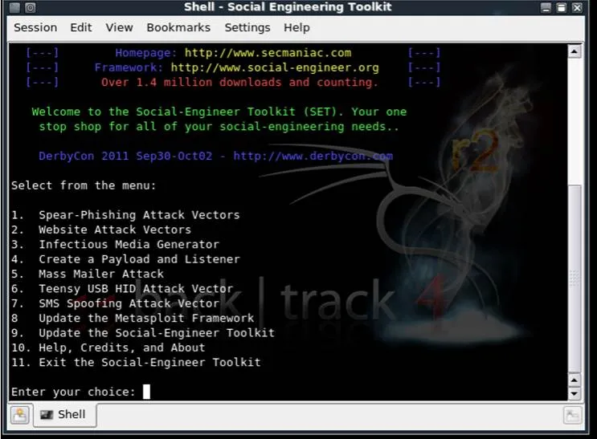

# LAB - Arp Spoofing 
## Introduction
> **Note**: Performing ARP spoofing attacks without permission is illegal and unethical. This guide is for educational purposes only. Always ensure you have explicit permission to test network security in this manner.


During this lab, you will practice layer 2 and layer 3 networking concept and understand spoofing attacks.
The goal of this is lab to explore Linux tools to perform a Man in The Middle (MiTM) attack.

A man in the middle attack occurs when an attacker secretly intercepts and relays communication between two 
parties who believe they are directly communicating with each other. The attacker can see all traffic passing 
between the two parties, allowing them to capture sensitive information, modify messages, or inject malicious content. 
This is achieved by positioning themselves in the communication path, often by spoofing network addresses or
exploiting vulnerabilities in network protocols.

## Requirements

### Network topology
For this lab, we will use the simple a LAN topology. Since ARP is a layer 2 protocol, it's limited by 
broadcast domains: you cannot perform this attack from a different LAN.
Every table is a LAN (as shown in the picture); you can choose your favourite addressing plan
(ie. 192.168.1.0/24). At the end of the setup, you will have a situation like in the picture.


### Disable Kali Linux Firewall
Linux (as other operating systems) has a firewall. For now, we are going to disable it, but more realistic
scenario requires to add complicated rules. First, Linux firewall is implemented in the kernel and it 
is called `iptables`. We will install an higher level tool to disable it.

```sh
sudo apt-get update
sudo apt-get install ufw
```
UFW (Uncomplicated firewall) can be used to open ports and stuff like that. We are simply going to disable it 
by executing:

```sh
sudo ufw disable
```

### Enable packet formwarding

You will need at least a Kali Linux per LAN: it will be used to perform the attack. 

### Enable IP Forwarding
To successfully perform a Man in the Middle attack, we need to enable IP forwarding on the attacker's machine. 
IP forwarding allows the machine to forward packets from one network interface to another, effectively routing
traffic through itself. This is crucial because, during the attack, the attacker intercepts the communication 
between two parties and needs to forward the packets to maintain the connection between them.


To enable IP forwarding, execute the following command:

```sh
echo 1 | sudo tee /proc/sys/net/ipv4/ip_forward
```

This command writes '1' to the IP forwarding configuration file, enabling the forwarding of IPv4 packets.
Without this step, intercepted packets would not be forwarded, breaking the communication between the victim and the target.


## Performing the attack
We will perform the attack in two different ways:

- using arpspoof
- using ettercap

### Arpspoof command
Arpspoof is a command utility used to flood the network with the advertising of a fake answer to an arp request

```sh
sudo arpspoof -i <interface> -t <target-ip> <spoof-ip>
```

> [!TIP]
> How would you use the arpspoof to perform a man in the middle? How would you check that the attack has success?


### Ettercap

Ettercap is a comprehensive suite for man-in-the-middle attacks on LAN. It features sniffing of live connections, content filtering on the fly, and many other interesting tricks. Here's a step-by-step guide on how to perform ARP spoofing using Ettercap:

1. **Install Ettercap**: If Ettercap is not already installed on your system, you can install it using the following command:
   ```sh
   sudo apt-get update
   sudo apt-get install ettercap-graphical
   ```

2. **Open Ettercap**: Launch Ettercap in graphical mode by executing:
   ```sh
   sudo ettercap -G
   ```

3. **Select Network Interface**: Once Ettercap is open, select the network interface you want to use for the attack. This is usually the interface connected to the LAN you are targeting.

4. **Scan for Hosts**: Go to the "Hosts" menu and select "Scan for hosts". Ettercap will scan the network and list all the available hosts.

5. **Add Targets**: 
   - Go to the "Hosts" menu and select "Hosts list".
   - In the list of hosts, select the target machine (the victim) and add it to Target 1.
   - Select the machine you want to impersonate (usually the gateway) and add it to Target 2.

6. **Start ARP Spoofing**:
   - Go to the "Mitm" menu and select "ARP poisoning".
   - In the dialog box, check "Sniff remote connections" and click "OK".

7. **Start Sniffing**: 
   - Go to the "Start" menu and select "Start sniffing". Ettercap will begin intercepting and relaying the communication between the two targets.

8. **Monitor Traffic**: You can now monitor the traffic between the victim and the gateway. Ettercap provides various plugins and filters to manipulate the traffic as needed.

9. **Stop the Attack**: Once you are done, go to the "Start" menu and select "Stop sniffing" to end the attack.

## Final Challenge: DNS Spoofing

A Man in the Middle (MiTM) attack allows an attacker to intercept and modify traffic between two parties. One common modification is DNS spoofing, where the attacker alters DNS queries to redirect traffic to malicious sites.

### Step 1: Understand DNS Spoofing

DNS spoofing involves intercepting DNS queries and providing false responses, redirecting users to malicious websites. This can be used to capture sensitive information or spread malware.

### Step 2: Use `dnsspoof`

To explore DNS spoofing, familiarize yourself with the `dnsspoof` tool. You can access its manual by running:

```sh
man dnsspoof
```

Perform a dnsspoof by running:

```sh
sudo dnsspoof -f hosts.txt -i <interface>
```


To perform DNS spoofing, `dnsspoof` requires a configuration file that maps domain patterns to IP addresses. Here is a sample configuration:

```
# Sample hosts file for dnsspoof
<my-ip-address> poste.it 
```


### Step 3: Block Legitimate DNS Queries

To ensure that Windows accepts your crafted DNS responses, you may need to block legitimate DNS queries. This can be done by configuring firewall rules to block outgoing DNS requests to external DNS servers. By doing this, you force the system to rely on your spoofed DNS responses, ensuring that your crafted entries are accepted.

To block outgoing DNS requests using `iptables`, you can use the following command:

```sh
sudo iptables -A FORWARD -p udp --dport 53 -j DROP
```

This command adds a rule to the `OUTPUT` chain to drop all outgoing UDP packets on port 53, which is used for DNS queries.

### Step 4: Verify DNS Spoofing with `nslookup`

On the victim machine, use the `nslookup` command to verify that DNS spoofing is successful. Ensure that the response is non-authoritative and matches the IP address specified in your `dnsspoof` configuration.

```sh
nslookup <spoofed-domain>
```

### Step 5: Spin Up a Web Server

On the attacker's machine, start a simple HTTP server using Python to serve as the destination for the spoofed domain. This will help verify that the DNS spoofing is redirecting traffic correctly.

```sh
sudo python -m http.server 80
```

Ensure that the domain specified in your `dnsspoof` configuration file redirects to this Python web server. Open a webrowser and ensure that `poste.it` goes to our webserver

### Step 6: Craft a Fake Website with the Social Engineering Toolkit

The Social Engineering Toolkit (SET) can be used to create a fake website to capture credentials. Follow these steps:

1. **Launch SET**: Open the Social Engineering Toolkit by executing:

   ```sh
   sudo setoolkit
   ```

   

2. **Select Attack Vector**: Choose `Website Attack Vectors` from the menu.

3. **Choose Attack Method**: Select `Credential Harvester Attack Method`.

   

4. **Redirect Victims**: Use the information from the SET documentation and online resources to redirect victims to your cloned website.


Redirect the victim to the cloned website, every POST request will be logged!
